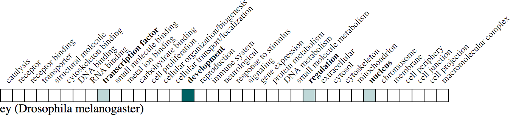
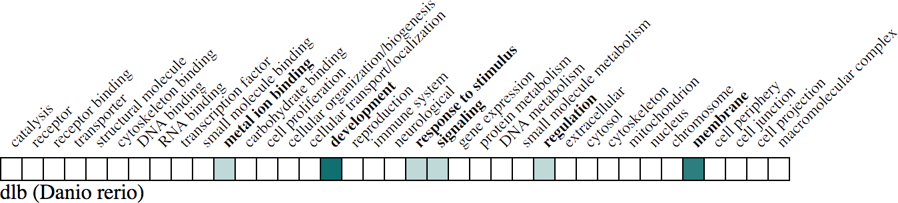
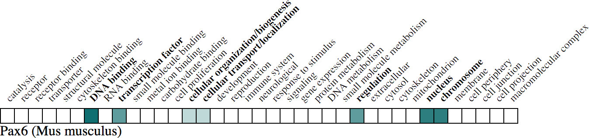

# ribbon
Short form matrix view of all GO annotations for a given gene

## Acknowledgments
- Thanks to Sibyl Gao (@sibyl229) for knowing what to do and how to it in packaging this, Josh Goodman for making his code available as a launching point, Seth Carbon (@kltm) for bearing with my naive questions, and Chris Mungall (@cmungall) for all the usual fantastic things he does

## Installation
- Make sure node.js is installed - see https://nodejs.org/en/download/

- Once node.js is on your machine then dependent packages need to be brought in. Running `npm install` in the components's root directory will install everything you need for development.
 - Note that you may need to run 'npm install' as sudo.

## Demo Ribbon Server

- `npm start` will run a local server with the ribbon's demo app at [http://localhost:3000](http://localhost:3000) with hot module reloading.
- To actually see a populated 'ribbon' you will need to provide the resource name and the resource's gene identifier in the URL. That is:  [http://localhost:3000/?db=MGI&id=MGI:97490](http://localhost:3000/?db=MGI&id=MGI:97490) or [http://localhost:3000/?db=ZFIN&id=ZDB-GENE-990415-173](http://localhost:3000/?db=ZFIN&id=ZDB-GENE-990415-173)

## Examples
- fly

- zebrafish

- mouse

## Build the library
`npm run build` will prepare the assets of the library for publishing to NPM.
